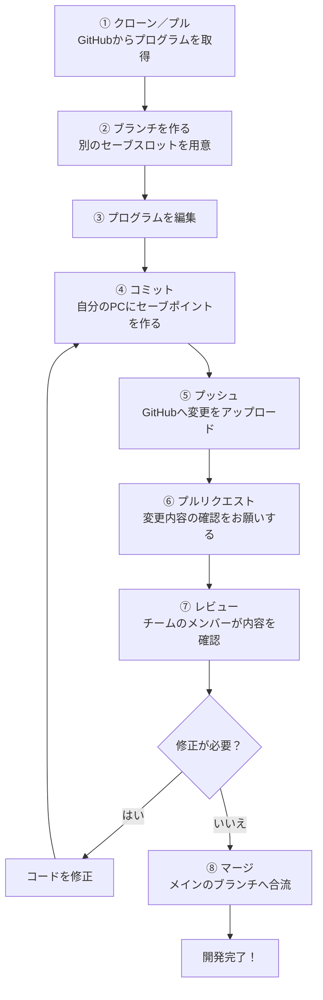

## Gitとは？

> Git＝ローカルでの履歴管理ツール

ファイルの変更管理履歴を記録・管理するためのツールです。
ローカル環境で履歴の確認や切り戻し、ブランチなどの作業ができます。
**自分のPCの中で履歴を管理する**のがポイントです。
![[Pasted image 20260719164600.png|317]]

インストールはコチラから
→　[https://git-scm.com/](https://git-scm.com/)

## GitHubとは？

> Gitを使ったプロジェクト管理サービス

![[Pasted image 20260719164721.png|536]]

Gitのリポジトリ（プロジェクト・フォルダ）をクラウド上で管理・共有するためのサービスです。チームでの共同開発やコード管理、レビューなどができます。
![[Pasted image 20260719164749.png|368]]

## GitとGitHubの比較

| 項目    | Git                                 | GitHub                         |
| ----- | ----------------------------------- | ------------------------------ |
| 役割    | バージョン管理システム                         | Gitを使ったクラウドサービス                |
| 主な場所  | ローカル（自分のPC）                         | クラウド上                          |
| できること | 履歴管理 コミット ブランチ作成・マージ 差分確認など | リポジトリの共有 チーム開発 プルリクエストなど |

## ゲームにたとえると？

Git・GitHubでの開発は、ゲームのセーブデータ管理に似ています。

- **作っているプログラム**：ゲーム本体
- **コミット**：その時点の状態を残すセーブポイント
- **ブランチ**：別の攻略を試すためのセーブスロット
- **GitHub**：みんなでセーブデータを共有するオンラインの保管場所

Gitを使うと、「変更したら動かなくなった！」というときも、前のセーブポイントに戻って確認できます。GitHubも使えば、自分のPCだけでなく、先生やチームのメンバーと同じプログラムを共有できます。

## よく使う専門用語

| 用語 | 読み方・意味 | ゲームにたとえると |
| --- | --- | --- |
| Repository | リポジトリ。プログラムのファイルと変更履歴をまとめて管理する場所 | ゲーム本体とセーブデータが入った箱 |
| Local Repository | ローカルリポジトリ。自分のPCにあるリポジトリ | 自分のゲーム機にあるセーブデータ |
| Remote Repository | リモートリポジトリ。GitHubなど、インターネット上にあるリポジトリ | オンライン上にある共有セーブデータ |
| Commit | コミット。変更した内容を、ひとまとまりの履歴として記録すること | 名前やメモを付けてセーブポイントを作ること |
| Push | プッシュ。自分のPCにあるコミットをGitHubへ送ること | 自分のセーブデータをオンラインへアップロードすること |
| Pull | プル。GitHubにある最新の変更を自分のPCへ取り込むこと | みんなの最新セーブデータをダウンロードすること |
| Clone | クローン。GitHubにあるリポジトリ一式を、自分のPCへ初めてコピーすること | ゲーム本体とセーブデータを丸ごと受け取ること |
| Branch | ブランチ。元のプログラムに影響を与えず、別の場所で変更を試す仕組み | セーブスロットを分けて、別ルートを攻略すること |
| Merge | マージ。別のブランチで行った変更を、元のブランチへ合流させること | 別ルートで手に入れた成果をメインのセーブデータへ反映すること |
| Pull Request | プルリクエスト（プルリク）。自分の変更を確認してもらい、合流してよいか相談する機能 | 「この攻略結果をメインデータに入れていい？」と仲間に確認をお願いすること |
| Review | レビュー。プルリクエストの内容を確認し、意見や修正点を伝えること | 仲間が攻略内容をチェックして、アドバイスすること |
| Issue | イシュー。バグ、やること、アイデアなどを記録・共有する機能 | 攻略したいクエストや、直したい不具合を書く掲示板 |
| Conflict | コンフリクト。同じ場所への変更が重なり、Gitが自動でマージできない状態 | 同じセーブデータを別々に変えたため、どちらを残すか決める必要がある状態 |

> [!NOTE]
> **コミットしただけではGitHubには保存されません。** コミットは自分のPC内でのセーブ、プッシュはGitHubへのアップロードです。

## 開発の流れ（GitとGitHubの関係）

> [!TIP]
> レビューで修正が必要になったら、コードを直して、もう一度コミットとプッシュをします。確認が終わるまで、この流れをくり返します。

## どんな人が使うの？

### Git

- 自分のPCで履歴を管理したい人
- 複数のバージョンを切り替えしたい人
- ブランチを使って開発したい人
- チーム開発の前に基礎を学びたい人

### GitHub

- チームで共同開発したい人
- コードを共有・公開したい人
- プルリクエストやIssueを使いたい人
- プロジェクトを効率的に管理したい人
